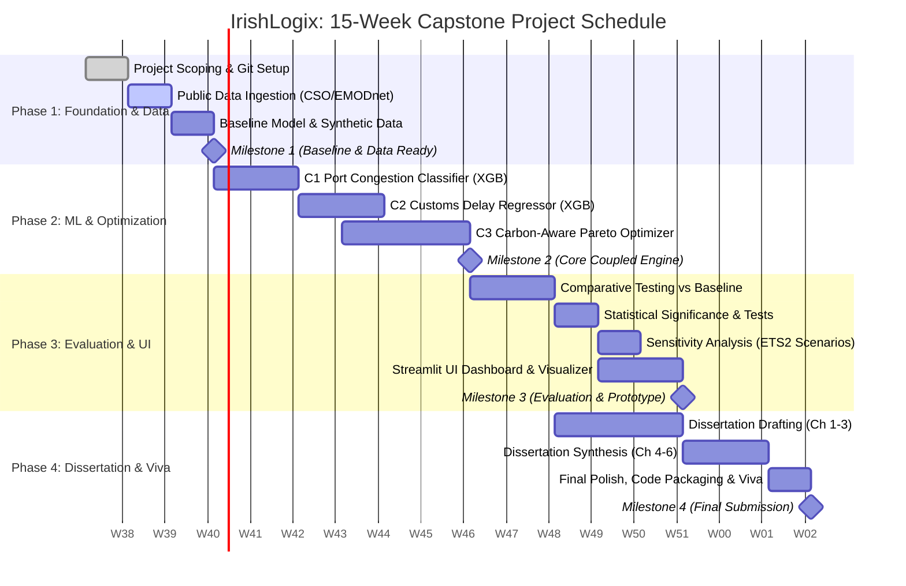

# National College of Ireland (NCI): MSc in Data Analytics
## Research Practicum (MSCDAD_A_JAN26I)
**Student Name:** Rohitkumar Amritlal Jaiswal  
**Student ID:** 25119613  
**Supervisor / Lecturer:** Dr. Thanos Staikopoulos  
**Date:** September 2026  

---

# Executive Checklist for Submission and Presentation

### 1. Tuesday Submission Items Verification
Verify that your submission directory `Submission_Package_Rohitkumar_Jaiswal_25119613` contains:
- [x] **Project Proposal (PDF):** `x25119613_Rohitkumar_Jaiswal_Project_Proposal.pdf`
- [x] **Literature Review References (ZIP):** `Literature_Review_References.zip` (contains the 7 cited papers and EU directives)
- [x] **Ethics Declaration Form (PDF):** `Rohitkumar_Jaiswal_Ethics_Declaration_Form.pdf` (fully completed, declaring secondary and synthetic data, zero human participants)
- [x] **Weekly Progress Report (PDF / DOCX):** `NCI_MSc_Data_Analytics_Weekly_Progress_Report_Week1.pdf`
- [x] **Interactive Jupyter Notebook:** `notebooks/01_week1_data_ingestion_and_exploration.ipynb`

---

# 1. Project Pitch Script (1 to 2 Minutes | Date: 1 October)

### Pitch Structure
**Problem -> Gap -> Idea -> Method -> Contribution**  
- **Audience:** Technical academics and peers (data science and computing background, non-logistics specialists).  
- **Target Duration:** Around 90 to 100 seconds (approx 220 words at a natural speaking rate of 140 words per minute).
- **Tone:** Direct, confident, conversational, and jargon-free.

---

### Spoken Script (Word-for-Word)

> "Good morning everyone.
>
> *(Problem / Context: 0:00 to 0:25)*  
> Ireland is an island economy where over 80 percent of external freight moves through maritime ports like Dublin, Cork, and Rosslare. Following Brexit, Irish hauliers face unpredictable customs inspections and severe port bottleneck delays, compounded by strict EU driver rest rules and upcoming carbon taxes. Yet today, most small and medium Irish freight operators still plan cross-border routes using static spreadsheets and gut feeling.
>
> *(Gap: 0:25 to 0:45)*  
> In current research, predictive delay forecasting and vehicle route optimization are treated in isolation. Existing vehicle routing algorithms assume fixed, deterministic travel speeds and completely ignore volatile port and customs interfaces. Furthermore, no existing framework couples machine learning delay forecasts with multi-objective route planning specifically tailored to post-Brexit Irish logistics.
>
> *(Idea: 0:45 to 1:05)*  
> My project, IrishLogix, bridges this gap by creating an integrated, closed-loop decision support system. We directly feed upstream machine learning delay predictions into a downstream carbon-aware route optimizer to produce optimal, resilient dispatch schedules.
>
> *(Method: 1:05 to 1:30)*  
> The system operates in three parts: First, an XGBoost classifier predicts next-day port congestion risk using official CSO maritime traffic and EMODnet vessel density data. Second, an XGBoost regressor estimates lane-specific customs clearance durations. Third, these dynamic time distributions feed into a bi-objective Pareto optimizer using OpenStreetMap road networks, balancing operational cost in Euros against tailpipe carbon intensity per kilometer.
>
> *(Contribution: 1:30 to 1:50)*  
> My contribution is twofold: Methodologically, I empirically measure the value of coupling predictive machine learning into prescriptive optimization under real-world uncertainty. Practically, I deliver an open-source, accessible Streamlit decision tool that helps Irish SME carriers cut idle waiting times, reduce fuel emissions, and easily comply with CSRD and ETS2 regulations without buying expensive enterprise software.
>
> Thank you, and I welcome your questions."

---

### Pitch Cue Card (Quick Reference Bullets)

| Stage | Key Points to Hit | Target Time |
| :--- | :--- | :--- |
| **1. Problem** | - Island economy: 80%+ maritime dependency (Dublin, Cork, Rosslare).<br>- Post-Brexit customs friction + driver hours (EC 561/2006) + ETS2 carbon pricing.<br>- SME hauliers still rely on static spreadsheets and intuition. | 0:00 to 0:25 |
| **2. Gap** | - Prediction and optimization exist as isolated silos in literature.<br>- Routing models assume static travel times; ignore port/border bottlenecks.<br>- No coupled decision system exists for the post-Brexit Irish corridor. | 0:25 to 0:45 |
| **3. Idea** | - IrishLogix: A coupled, closed-loop predictive-prescriptive decision platform.<br>- Feeds upstream stochastic ML predictions directly into downstream multi-objective routing. | 0:45 to 1:05 |
| **4. Method** | - C1: XGBoost classifier for port congestion (CSO + EMODnet AIS vessel data).<br>- C2: XGBoost regressor for customs clearance duration (calibrated synthetic CSO data).<br>- C3: Bi-objective Pareto optimizer (cost vs. gCO2e/km) via SciPy and OpenStreetMap. | 1:05 to 1:30 |
| **5. Contribution** | - Methodological: Proves whether ML delay forecasts truly improve downstream operational decisions over spreadsheet baselines.<br>- Practical: Open, low-cost Streamlit tool for Irish SME hauliers for CSRD/ETS2 decarbonisation. | 1:30 to 1:50 |

---

### Anticipated Q&A and Technical Defense

1. **Q: Why use synthetic data for the customs clearance component (C2)?**  
   *Answer:* Customs inspection duration and per-consignment clearance times are commercially confidential and strictly restricted by Irish Revenue. To address this without introducing artificial bias, I calibrate the synthetic data distributions against published CSO cross-border trade lane statistics and validation thresholds from trade literature (Bilbao-Ubillos et al., 2021). All synthetic generators are transparent, version-controlled, and declared under our NCI ethics submission.

2. **Q: Why choose XGBoost over Deep Learning (e.g., LSTM or Graph Neural Networks)?**  
   *Answer:* The input data consists of structured tabular metrics (CSO quarterly tonnage, vessel density index, seasonal indicators, and trade volume). Gradient boosted trees (XGBoost) consistently outperform deep architectures on small-to-medium tabular datasets, require significantly less hyperparameter tuning, offer native handling of missing values, and allow direct interpretability via SHAP values for dispatchers.

3. **Q: How does the route optimizer handle conflicting cost and carbon objectives?**  
   *Answer:* It generates a non-dominated Pareto frontier using bi-objective optimization rather than forcing a single weighted-sum score. This allows the freight dispatcher to examine the explicit trade-off curve, for example, observing that paying 4 percent more in transport cost can yield a 16 percent reduction in carbon emissions by avoiding peak port idling.

---

# 2. Refined Research Proposal Components (Title, RQ, Objectives)

### 2.1 Refined Research Title Options

* **Option 1 (Recommended: Balanced & High Impact):**  
  > "Coupling Predictive Delay Analytics with Carbon-Aware Multi-Objective Route Optimisation for Post-Brexit Irish Freight Corridors"
* **Option 2 (Technically Rigorous):**  
  > "A Coupled Machine Learning and Pareto Optimisation Framework for Decarbonised Freight Logistics Under Post-Brexit Border Friction"
* **Option 3 (Applied / Decision Support Focus):**  
  > "IrishLogix: Predictive Port Congestion, Customs Delay Forecasting, and Green Routing for SME Freight Carriers"

---

### 2.2 Refined Research Questions

#### Primary Research Question (PRQ)
> **"To what extent does an integrated decision-support system coupling machine learning delay predictions with carbon-aware multi-objective route optimisation outperform traditional spreadsheet-based planning in reducing vehicle waiting hours, operational costs, and carbon intensity across post-Brexit Irish freight corridors?"**

#### Secondary Sub-Research Questions (SRQs)
* **SRQ 1 (Predictive Modeling):** How accurately can gradient-boosted models predict next-day port congestion risk categories and lane-specific customs clearance delays using open maritime and calibrated trade data?
* **SRQ 2 (Prescriptive Coupling & Operational Performance):** Does integrating stochastic upstream delay predictions into a bi-objective route optimizer deliver statistically significant reductions in vehicle idle waiting time and total transit cost compared to static FIFO spreadsheet planning?
* **SRQ 3 (Decarbonisation & Policy Sensitivity):** How resilient is the generated Pareto frontier to fluctuating EU ETS2 carbon prices (EUR 40 to EUR 120 per tonne) and variable customs inspection regimes in achieving CSRD-aligned fleet emissions reductions?

---

### 2.3 Refined SMART Research Objectives (ROs)

* **RO1 (Data Acquisition & Preprocessing):** Ingest and curate open maritime data (CSO port traffic, EMODnet AIS vessel density) and engineer a calibrated, statistically grounded synthetic customs clearance dataset across nine major Irish trade corridors.
* **RO2 (Predictive Model Development & Validation):** Train, tune, and evaluate an XGBoost classification model for port congestion (evaluated via F1-score and Brier score) and an XGBoost regression model for customs clearance delay (evaluated via MAE and RMSE) under time-series nested cross-validation.
* **RO3 (Bi-Objective Route Optimizer Formulation):** Formulate and implement a bi-objective mathematical optimization model in Python (SciPy/NetworkX) utilizing OpenStreetMap road networks, simultaneously minimizing total operational cost (EUR) and carbon intensity (gCO2e/km) based on dynamic travel time inputs.
* **RO4 (Empirical Evaluation & Sensitivity Benchmarking):** Execute a rigorous comparative experiment against a baseline FIFO spreadsheet planning model across identical demand instances, conducting paired statistical significance tests (Wilcoxon signed-rank / paired t-test) and sensitivity analyses across varying ETS2 carbon prices (EUR 40 to EUR 120 per tonne).
* **RO5 (Artefact Delivery & Visualisation):** Encapsulate the end-to-end pipeline into an interactive, open-source Streamlit dashboard featuring Folium route geo-visualizations, Plotly Pareto frontiers, and SHAP explainability for dispatcher usability.

---

# 3. Significance and Academic Contribution (Literature Grounded)

### 3.1 What is Different and New About Your Approach?

1. **Closing the "Prediction-to-Optimization" Void:**  
   Most literature treats predictive analytics (forecasting delays) and prescriptive analytics (vehicle routing) as separate disciplines. As highlighted by **Zamani et al. (2022)**, there is an acute research void in single decision-support systems that couple both. This project directly pipes upstream uncertainty into downstream multi-objective algorithms.
2. **Beyond Urban Last-Mile to Multimodal Cross-Border Freight:**  
   The foundational paper by **Cheng et al. (2024)** explored low-carbon vehicle routing for Light Commercial Vehicles (LCVs) restricted to an urban metropolitan grid in China with static speeds. This research extends routing theory to **international multimodal corridors** (Dublin Port, Port of Cork, Rosslare Europort), where road legs intersect with Ro-Ro ferry schedules and maritime bottlenecks.
3. **Stochastic Port & Border Dynamics vs. Deterministic Assumptions:**  
   While standard TMS tools assume fixed travel times, this project explicitly models post-Brexit operational friction: physical documentary customs holds (Bilbao-Ubillos et al., 2021) and port berth congestion derived from AIS vessel turnaround patterns (Chu et al., 2024).
4. **Targeting Underserved SME Hauliers vs. Proprietary Enterprise Suites:**  
   Existing commercial TMS tools (e.g., SAP, Manhattan Associates) cost tens of thousands of euros. Irish freight is dominated by SMEs using Excel. This project delivers an open-source, mathematically rigorous alternative.

---

### 3.2 Literature Comparison Matrix

| Dimension | Base Paper: Cheng et al. (2024) | Broader Literature | Proposed Study (IrishLogix) | Distinct Advantage |
| :--- | :--- | :--- | :--- | :--- |
| **Geographic Context** | Urban city last-mile distribution (China). | Port of Rotterdam megaport (Parolas, 2016); Dry ports (Shoukat & Zhang, 2022). | Post-Brexit Irish multimodal freight corridors (Dublin, Cork, Rosslare). | Addresses island economy vulnerabilities and post-Brexit customs friction. |
| **Travel Time Dynamics** | Deterministic / static travel speeds. | Global AIS vessel turnaround models (Chu et al., 2024). | Dynamic & stochastic delay distributions (berth queue + customs check). | Eliminates sub-optimization caused by ignoring bottleneck waiting times. |
| **System Architecture** | Standalone heuristic routing algorithm. | Theoretical reviews of AI in supply chains (Zamani et al., 2022). | End-to-end coupled pipeline (XGBoost C1 & C2 -> Pareto Optimizer C3). | Demonstrates empirical value of coupling predictive ML with mathematical programming. |
| **Environmental Scope** | Basic tailpipe distance minimization. | Strategic Pareto supply chain design (Palacio et al., 2017). | Multi-objective trade-off (Cost EUR vs. gCO2e/km) with ETS2 carbon pricing. | Enables regulatory reporting under EU CSRD (2022/2464) and ETS2 (2023/959). |
| **Baseline Benchmark** | Algorithmic comparison only (GA vs. PSO). | Macroeconomic trade impact (Bilbao-Ubillos et al., 2021). | Dual benchmark: Statistical accuracy + practical Excel FIFO dispatcher comparison. | Quantifies practical business advantage for real SME transport planners. |

---

### 3.3 Contribution to the Body of Knowledge

* **Methodological Contribution:** Provides empirical evidence on the *propagation of error* in predictive-prescriptive pipelines: answering whether upstream ML forecast errors degrade downstream routing decisions, or whether coupled optimization remains superior to static planning even under noisy predictions.
* **Practical / Industrial Contribution:** Bridges the digital divide for Irish SME hauliers by providing a transparent, cost-free optimization framework capable of lowering port gate turn-around times, minimizing driver idle rest breaches under Regulation (EC) No 561/2006, and lowering diesel consumption.
* **Policy & Regulatory Contribution:** Embeds impending EU decarbonisation mechanisms (CSRD emissions auditing and ETS2 carbon price bands modeled after Tabash et al., 2024), offering a blueprint for haulage compliance before mandatory 2027/2028 deadlines.

---

# 4. Updated Project Plan & Gantt Chart (15-Week Timeline)

### 4.1 Granular Weekly Activity Breakdown

```
W01 to W03: Phase 1: Foundation, Baseline & Data Pipeline
W04 to W09: Phase 2: Predictive Modeling & Optimizer Engine (Core ML/OR)
W10 to W13: Phase 3: Comparative Evaluation, Benchmarking & Sensitivity
W12 to W15: Phase 4: Dissertation Writing, Dashboard Artefact & Viva Prep
```

| Week | Work Package / Activity | Key Tasks & Technical Steps | Dependencies | Expected Deliverables |
| :---: | :--- | :--- | :--- | :--- |
| **W1** | **Project Setup & Scoping** | - Align proposal feedback with supervisor.<br>- Finalize directory structure, Git repo, and virtual environment (`uv`/pip).<br>- Download CSO tables (TBQ01, TBQ04, TBQ05) and build Week 1 Jupyter notebook.<br>- Build baseline FIFO dispatcher simulator and benchmark. | Proposal approval | Finalized scope, environment, Jupyter notebook, and baseline benchmark. |
| **W2** | **Public Data Ingestion (CSO & EMODnet)** | - Ingest EMODnet AIS vessel density maps for Irish coastal waters.<br>- Merge quarterly CSO maritime activity with spatial AIS density.<br>- Clean OpenStreetMap corridor road network. | W1 | Preprocessed raw data pipelines (`cso_loader.py` + AIS integration). |
| **W3** | **Baseline Model & Synthetic Data Calibration** | - Calibrate synthetic customs delay generator (`generate_customs_data.py`) against official CSO trade statistics.<br>- Refine baseline FIFO simulation model. | W2 | **Milestone 1 (M1):** Baseline planner complete & data ready. |
| **W4** | **C1 Feature Engineering** | - Engineer rolling maritime congestion indices, seasonal lags, vessel dwell times.<br>- Time-series split setup. | W3 | Feature store for Port Congestion. |
| **W5** | **C1 Port Classifier (XGBoost)** | - Train XGBoost classifier for next-day congestion risk.<br>- Hyperparameter tuning with Bayesian Search.<br>- Evaluate F1 & Brier score. | W4 | Trained C1 model artifact + SHAP feature importance plot. |
| **W6** | **C2 Customs Feature Engineering** | - Feature encoding for commodity risk, lane volume, inspection tier, origin flag. | W3 | Customs training dataset. |
| **W7** | **C2 Customs Regressor (XGBoost)** | - Train XGBoost regressor for clearance duration (hrs).<br>- Validate via nested CV; record MAE, RMSE, and R2. | W6 | Trained C2 model artifact & residual diagnostics. |
| **W8** | **C3 Formulation & Cost Functions** | - Define multi-objective function: Min Cost (EUR) & Min Carbon (gCO2e/km).<br>- Incorporate EC 561/2006 driver break constraints. | W5, W7 | Mathematical optimization formulation in SciPy/NetworkX. |
| **W9** | **C3 Pareto Solver & Coupling Integration** | - Connect C1 & C2 delay outputs as stochastic inputs to C3.<br>- Implement Pareto frontier solver. | W8 | **Milestone 2 (M2):** Fully coupled end-to-end pipeline operational. |
| **W10** | **Comparative Testing & Evaluation** | - Run dual simulation across identical benchmark test demands.<br>- Compute vehicle waiting time, on-time delivery %, cost, and carbon intensity. | W9 | Comparative evaluation dataset & metrics table. |
| **W11** | **Statistical Significance Testing** | - Perform Wilcoxon signed-rank & paired t-tests (95% CI).<br>- Analyze prediction error propagation on route quality. | W10 | Statistical significance report & hypothesis test results. |
| **W12** | **Sensitivity Analysis & Initial Writing** | - Stress-test ETS2 carbon prices (EUR 40, EUR 80, EUR 120 per tonne).<br>- Draft Methodology & Literature Review chapters. | W11 | Sensitivity curves & Dissertation Chapters 1 to 3 draft. |
| **W13** | **Streamlit UI Development** | - Build interactive dispatcher dashboard (Folium map, Plotly Pareto curves, SHAP). | W9, W12 | **Milestone 3 (M3):** Evaluation finalized & UI prototype active. |
| **W14** | **Dissertation Refinement & Results Synthesis** | - Write Evaluation, Discussion, and Conclusion chapters.<br>- Review formatting, Harvard referencing, and academic integrity code. | W12, W13 | Complete draft dissertation for supervisor review. |
| **W15** | **Final Packaging & Viva Prep** | - Package GitHub repository, reproduce results with random seeds.<br>- Prepare slide deck and demo recording for viva voce. | W14 | **Milestone 4 (M4):** Final Dissertation, Codebase & Artefact Submission. |

---

### 4.2 Project Milestones Summary

* **Milestone 1 (M1: Week 3):** Foundation complete: Baseline spreadsheet model built, open data pipelines ingested, synthetic data calibrated.
* **Milestone 2 (M2: Week 9):** Implementation complete: C1 Port Classifier, C2 Customs Regressor, and C3 Pareto Optimizer trained and coupled.
* **Milestone 3 (M3: Week 13):** Evaluation & Benchmarking complete: Dual comparison, statistical hypothesis tests, and sensitivity analysis finalized; Streamlit UI prototype active.
* **Milestone 4 (M4: Week 15):** Final Hand-in: Complete MSc Dissertation, open-source code repository, reproducible artifacts, and viva presentation deck submitted.

---

### 4.3 Visual Mermaid Gantt Chart



---

# 5. Primary Public Dataset Sources & URLs

Below are the primary data sources downloaded and integrated into the project:

1. **CSO Ireland Table TBQ01 (Vessel Arrivals by Port and Quarter):**
   - Web URL: https://data.cso.ie/table/TBQ01
   - REST API: https://ws.cso.ie/public/api.restful/PxStat.Data.Cube_API.ReadDataset/TBQ01/CSV/1.0/en
   - Usage: Measures quarterly ship traffic into Dublin, Cork, and Rosslare for Component 1 port congestion modeling.
2. **CSO Ireland Table TBQ02 (Tonnage of Goods Handled by Cargo Category):**
   - Web URL: https://data.cso.ie/table/TBQ02
   - REST API: https://ws.cso.ie/public/api.restful/PxStat.Data.Cube_API.ReadDataset/TBQ02/CSV/1.0/en
   - Usage: Captures Ro-Ro and Lo-Lo cargo volumes.
3. **CSO Ireland Table TBQ04 (Ro-Ro Freight Unit Traffic):**
   - Web URL: https://data.cso.ie/table/TBQ04
   - REST API: https://ws.cso.ie/public/api.restful/PxStat.Data.Cube_API.ReadDataset/TBQ04/CSV/1.0/en
   - Usage: Inward and outward unit movements across Irish ports.
4. **CSO Ireland Table TBQ05 (Goods Handled by Port and Region of Trade):**
   - Web URL: https://data.cso.ie/table/TBQ05
   - REST API: https://ws.cso.ie/public/api.restful/PxStat.Data.Cube_API.ReadDataset/TBQ05/CSV/1.0/en
   - Usage: Evaluates post-Brexit freight diversion between Great Britain and EU direct shipping routes.
5. **EMODnet Human Activities (Marine Vessel Density):**
   - Web URL: https://emodnet.ec.europa.eu/en/human-activities
   - Usage: AIS vessel tracking density in Irish territorial waters.
6. **OpenStreetMap Ireland (Geofabrik Extract):**
   - Web URL: https://download.geofabrik.de/europe/ireland-and-northern-ireland.html
   - Usage: National road network geometry and distances for corridor routing.
